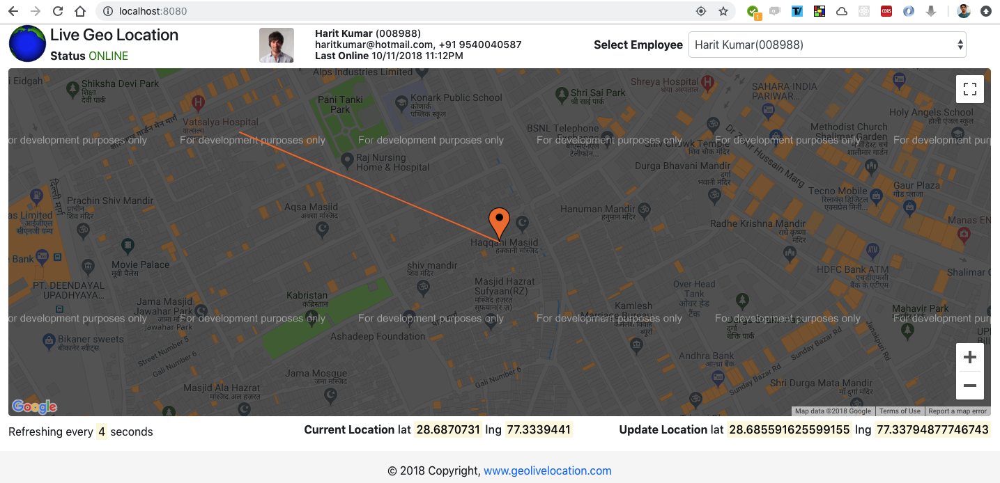

# real-time-gps-locator
Real time location and moving path locator using google map javascript api

### Step 1: Create a project in google api console
https://console.cloud.google.com/apis/

### Step 2: Enable Google map javascript api and copy api key to `index.html`

### Step 3: Start spring boot project and access `http://localhost:8080`

### Random lat lng generator
```java
public static Location getLocation(double x0, double y0, int radius) {
	    Random random = new Random();

	    // Convert radius from meters to degrees
	    double radiusInDegrees = radius / 111000f;

	    double u = random.nextDouble();
	    double v = random.nextDouble();
	    double w = radiusInDegrees * Math.sqrt(u);
	    double t = 2 * Math.PI * v;
	    double x = w * Math.cos(t);
	    double y = w * Math.sin(t);

	    // Adjust the x-coordinate for the shrinking of the east-west distances
	    double new_x = x / Math.cos(Math.toRadians(y0));

	    double foundLongitude = new_x + x0;
	    double foundLatitude = y + y0;
	    System.out.println("Longitude: " + foundLongitude + "  Latitude: " + foundLatitude );
	    long cv = Math.round( Math.random() );
	    if(cv == 1) {
	    	 return new Location(foundLatitude, foundLongitude,"ONLINE");
	    }else {
	     	return new Location(foundLatitude, foundLongitude,"OFFLINE");
	    }
	   
	}
```
### Demo


### Note
Google Maps is no longer free. You have to associate a credit card so that you can get billed if your site has requests that exceed the $200 credit they give you monthly for free. That is why you get the watermarked maps.

For more information, see: https://cloud.google.com/maps-platform/pricing/

Update: A common problem with the new billing system is that you now have to activate each API separately. They all have different pricing (some are even free), so Google makes a point of having you enable them individually for your domain. I was never a heavy user of Google Maps, but I get the feeling that there are many more APIs now than there used to be.

So if you're still getting a restricted usage message after you've enabled billing, find out what API you need exactly for the features you want to offer, and check if it's enabled. The API settings are annoyingly hard to find.

Go to this link: https://console.developers.google.com/apis/dashboard.
Then you select your project in the dropdown.
Go to library on the left pane.
Browse the available APIs and enable the one you need.
